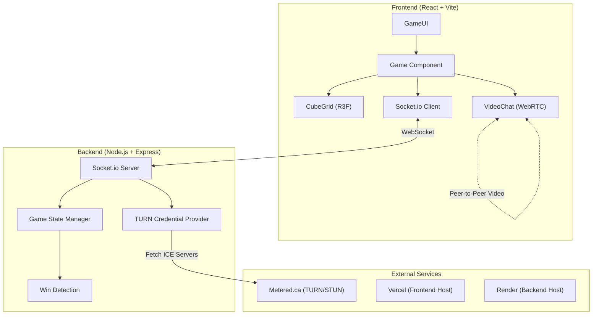
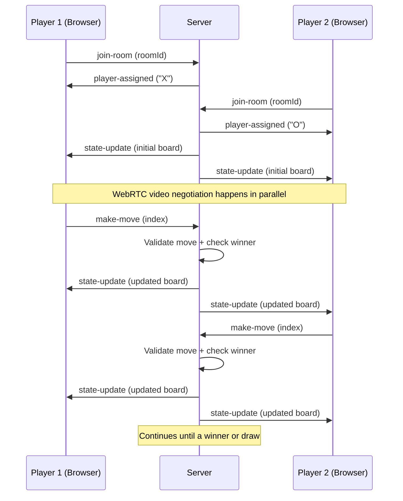
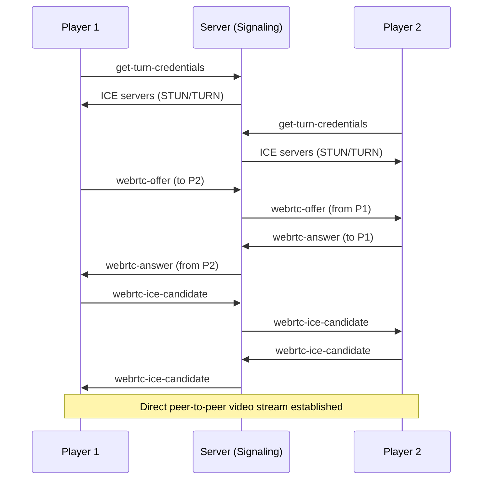

# 3D Multiplayer Tic Tac Toe + Video Chat

A real-time multiplayer take on the classic game — played on a **3×3×3 cube** rendered in 3D, with built-in **peer-to-peer video chat** so you can see your opponent's face while you play.

> **Try it live →** [3d-tic-tac-toe-virid.vercel.app](https://3d-tic-tac-toe-virid.vercel.app/)

---

## What is this?

Instead of the usual flat 3×3 grid, this version stacks **three layers** into a 27-cell cube. You need to get three in a row across any axis — horizontal, vertical, or diagonal through the depth of the cube. It's surprisingly tricky.

Two players connect to the same room, the server assigns X and O, and the game begins. Every move is validated on the server so nobody can cheat. While you play, WebRTC sets up a direct video connection between browsers — no video ever touches the server.

---

## Architecture

### System Overview



### Game Flow



### WebRTC Signaling



---

## Project Structure

```
3d_tic_tac_toe/
├── client/                    # Frontend (React + Vite)
│   └── src/
│       ├── App.jsx            # Root component, routing
│       ├── components/
│       │   ├── Game.jsx       # Main game container
│       │   ├── GameUI.jsx     # HUD, status, controls
│       │   ├── CubeGrid.jsx   # 3D board (React Three Fiber)
│       │   └── VideoChat.jsx  # WebRTC video chat
│       ├── game/
│       │   ├── gameLogic.js   # Client-side game helpers
│       │   └── winLines.js    # All 49 possible winning lines
│       └── network/
│           └── socket.js      # Socket.io client setup
│
└── server/                    # Backend (Node.js + Express)
    ├── index.js               # Server entry — rooms, moves, signaling
    └── winLines.js            # Win detection (server-side copy)
```

---

## Tech Stack

| Layer      | Technology                        |
|------------|-----------------------------------|
| 3D Engine  | React Three Fiber + Drei          |
| Frontend   | React, Vite                       |
| Realtime   | Socket.io                         |
| Video Chat | WebRTC (with Metered.ca TURN)     |
| Backend    | Node.js, Express                  |
| Hosting    | Vercel (frontend), Render (backend) |

---

## Running Locally

**Prerequisites:** Node.js 18+

```bash
# Clone
git clone https://github.com/rogueslasher/3d_tic_tac_toe.git
cd 3d_tic_tac_toe

# Start the backend
cd server
npm install
node index.js        # runs on port 3001

# In a second terminal — start the frontend
cd client
npm install
npm run dev          # runs on port 5173
```

Open two browser tabs to `http://localhost:5173`, join the same room, and you're playing.

> **Note:** Video chat uses STUN servers by default, which works on the same network. For cross-network video, set `METERED_API_KEY` as an environment variable on the server.

---

## How the Game Works

1. **Room creation** — The first player to join a room gets assigned **X**. The second gets **O**. Anyone else joins as a spectator.
2. **Making moves** — Clicks on a cell send the cell index to the server. The server checks it's your turn, the cell is empty, and the game isn't over — then updates everyone.
3. **Win detection** — The server checks all 49 possible winning lines (rows, columns, diagonals across all three axes and through the cube's diagonals) after every move.
4. **Video chat** — On joining, the server provides TURN/STUN credentials. Browsers exchange WebRTC offers and ICE candidates through the server, then connect directly for video.
5. **Reset** — Either player can reset the board. Spectators cannot.

---

## Future Plans

- Spectator mode improvements
- Persistent rooms across server restarts
- In-game text chat
- Match history and leaderboards
- Mobile-friendly controls
- Animated win highlights on the 3D board

---

